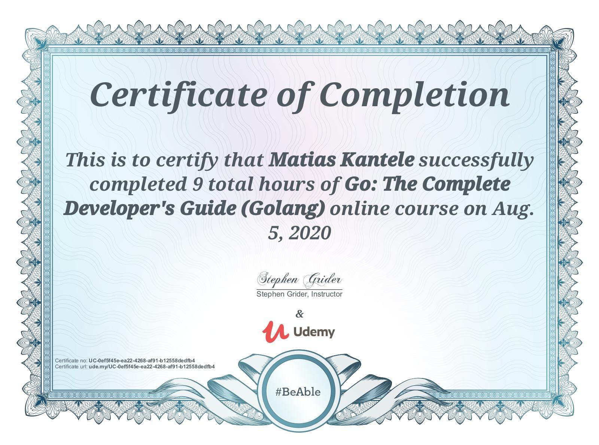

# Go: The Complete Developer's Guide (Golang)

[https://www.udemy.com/course/go-the-complete-developers-guide/](https://www.udemy.com/course/go-the-complete-developers-guide/)

## What you'll learn

- Build massively concurrent programs with Go Routines and Channels
- Learn the advanced features of Go
- Understand the differences between commonly used data structures
- Prove your knowledge with dozens of included quiz questions
- Apply Interfaces to dramatically simplify complex programs
- Use types to future-proof your code and reduce the difficulty of refactors

## Status: **Completed**

