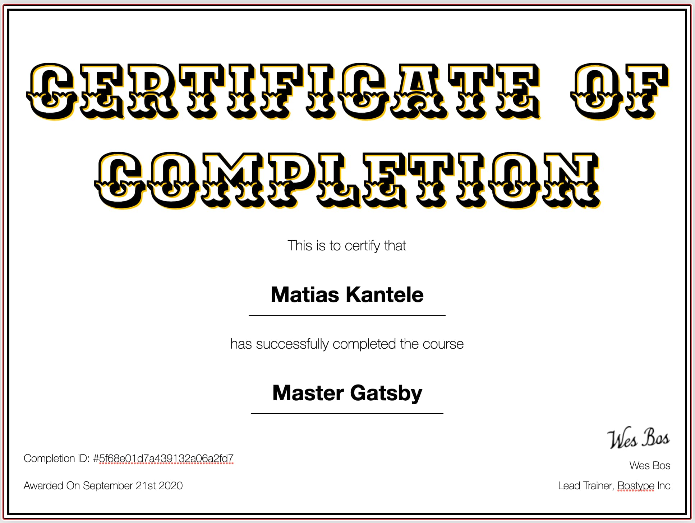

# Master Gatsby

[https://mastergatsby.com/](https://mastergatsby.com/)

## What will be built

Website for a local pizza joint called Slick's Slices. The site includes everything you'd run into in building a website today and is meant to be a nice copy/paste reference for the sites you build.

Some of the topics we touch upon are:

- Multiple Data Types
- Custom Fields
- Progressive Images
- Relational Data
- Scoped CSS
- Sourcing Data from a REST API
- Sourcing Data from a CMS
- Tags + Filtering
- Reusable Components
- Dynamically Generated pages
- Pagination
- Dynamic Order Form
- Client side Fetching
- Cross Page State Management
- SEO + Meta Tags
- Emailing of Order
- Building
- Deployment & Hosting

## Completion: **100%**

