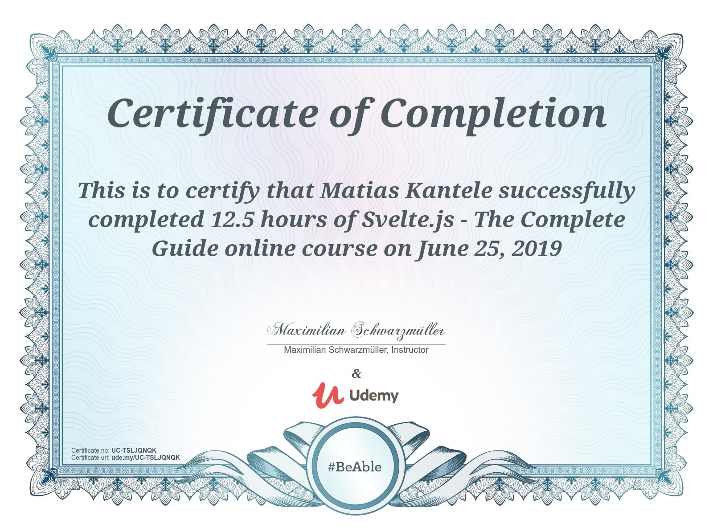

# Svelte.js - The Complete Guide (incl. Sapper.js)

[https://www.udemy.com/course/sveltejs-the-complete-guide/](https://www.udemy.com/course/sveltejs-the-complete-guide/)

## What you'll learn

- SvelteJS from scratch, with zero knowledge assumed
- All the theory and practical applications of Svelte
- Core concepts and advanced techniques to build Svelte applications

## Completion: **100%**

